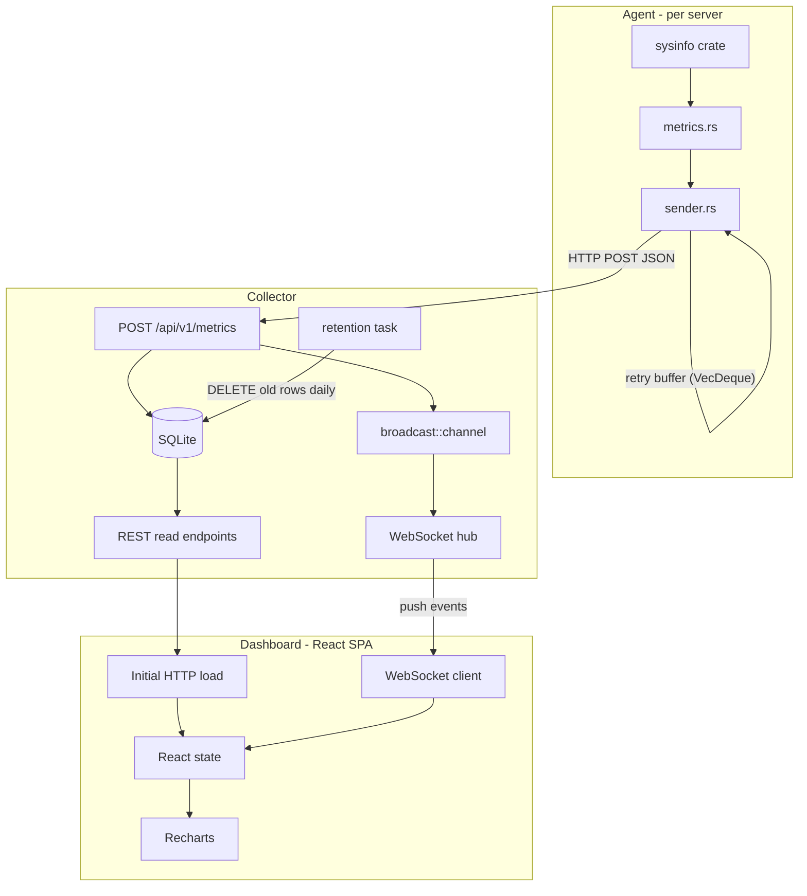

# RustNexus — Architecture Design

## Repository Layout (Cargo Workspace + Dashboard)

```
RustNexus/
├── Cargo.toml              ← workspace root
├── Cargo.lock
├── shared/                 ← library crate (payload & threshold types shared by agent + collector)
│   ├── Cargo.toml
│   └── src/lib.rs
├── agent/                  ← binary crate
│   ├── Cargo.toml
│   ├── agent.example.toml
│   └── src/
│       ├── main.rs
│       ├── config.rs       ← parse & validate TOML config
│       ├── metrics.rs      ← sysinfo collection logic
│       └── sender.rs       ← HTTP POST + in-memory retry buffer
├── collector/              ← binary crate
│   ├── Cargo.toml
│   ├── collector.example.toml
│   └── src/
│       ├── main.rs
│       ├── config.rs
│       ├── db/
│       │   ├── mod.rs
│       │   ├── migrations/  ← .sql files run by sqlx at startup
│       │   └── queries.rs
│       ├── api/
│       │   ├── mod.rs
│       │   ├── ingest.rs   ← POST /api/v1/metrics
│       │   ├── agents.rs   ← GET agents, snapshots, history
│       │   ├── thresholds.rs
│       │   └── ws.rs       ← WebSocket upgrade & broadcast
│       └── retention.rs    ← scheduled data purge task
└── dashboard/              ← React SPA (not in Cargo workspace)
    ├── package.json
    ├── vite.config.ts
    └── src/
        ├── App.tsx
        ├── api/client.ts   ← REST + WebSocket client
        ├── types/index.ts
        ├── hooks/
        │   ├── useWebSocket.ts
        │   └── useAgents.ts
        └── components/
            ├── AgentCard.tsx
            ├── AgentDetail.tsx
            ├── MetricChart.tsx
            ├── ThresholdEditor.tsx
            └── StatusBadge.tsx
```

---

## Component Data Flow




---

## Database Schema (SQLite)

```sql
-- Tracks every known agent
CREATE TABLE agents (
    agent_id      TEXT PRIMARY KEY,
    first_seen_at TEXT NOT NULL,   -- ISO 8601 UTC
    last_seen_at  TEXT NOT NULL,   -- ISO 8601 UTC
    duplicate_flag INTEGER NOT NULL DEFAULT 0  -- 1 = conflict detected
);

-- One row per metric report from an agent
CREATE TABLE metrics (
    id                  INTEGER PRIMARY KEY AUTOINCREMENT,
    agent_id            TEXT    NOT NULL REFERENCES agents(agent_id),
    timestamp           TEXT    NOT NULL,  -- ISO 8601 UTC
    cpu_percent         REAL    NOT NULL,
    memory_used_bytes   INTEGER NOT NULL,
    memory_total_bytes  INTEGER NOT NULL,
    memory_percent      REAL    NOT NULL,
    network_bytes_in    INTEGER NOT NULL,
    network_bytes_out   INTEGER NOT NULL,
    uptime_seconds      INTEGER NOT NULL
);
CREATE INDEX idx_metrics_agent_ts ON metrics(agent_id, timestamp);

-- Disk readings are 1-to-many per metric row (multiple mount points)
CREATE TABLE disk_readings (
    id          INTEGER PRIMARY KEY AUTOINCREMENT,
    metric_id   INTEGER NOT NULL REFERENCES metrics(id) ON DELETE CASCADE,
    mount_point TEXT    NOT NULL,
    used_bytes  INTEGER NOT NULL,
    total_bytes INTEGER NOT NULL,
    percent     REAL    NOT NULL
);

-- Per-agent or global thresholds (agent_id NULL = global default)
CREATE TABLE thresholds (
    id             INTEGER PRIMARY KEY AUTOINCREMENT,
    agent_id       TEXT,   -- NULL = applies to all agents
    metric_name    TEXT NOT NULL,   -- 'cpu' | 'memory' | 'disk'
    warning_value  REAL NOT NULL DEFAULT 0,
    critical_value REAL NOT NULL DEFAULT 0,
    UNIQUE(agent_id, metric_name)
);
```

---

## REST API Contract

All endpoints are served by the collector. Base path: `/api/v1`.

**Write (Agent → Collector)**

- `POST /api/v1/metrics`
  - Body: `MetricPayload` (see Shared Types below)
  - Responses: `200 OK`, `400 Bad Request` (malformed), `503 Service Unavailable` (DB down)

**Read (Dashboard → Collector)**

- `GET /api/v1/agents`
  - Returns: array of `AgentSummary` (id, status, last_seen_at, duplicate_flag, latest metric snapshot)
- `GET /api/v1/agents/:agent_id/snapshot`
  - Returns: `MetricSnapshot` (latest reading with disk array)
- `GET /api/v1/agents/:agent_id/history?range=1h|6h|24h|7d`
  - Returns: array of `MetricSnapshot` ordered by timestamp ASC, subsampled if needed for large ranges
- `GET /api/v1/thresholds`
  - Returns: all threshold rows
- `POST /api/v1/thresholds`
  - Body: `{ agent_id?, metric_name, warning_value, critical_value }`
- `PUT /api/v1/thresholds/:id`
  - Body: `{ warning_value, critical_value }`
- `DELETE /api/v1/thresholds/:id`

**WebSocket**

- `GET /ws` — upgrade to WebSocket

---

## WebSocket Message Protocol

All messages are JSON. The collector sends `metric_update` events to all connected dashboard clients immediately after persisting a payload.

```json
{
  "event": "metric_update",
  "agent_id": "server-01",
  "timestamp": "2026-03-10T12:00:00Z",
  "status": "online",
  "cpu_percent": 42.5,
  "memory": {
    "used_bytes": 4294967296,
    "total_bytes": 8589934592,
    "percent": 50.0
  },
  "disks": [
    { "mount_point": "/", "used_bytes": 107374182400, "total_bytes": 214748364800, "percent": 50.0 }
  ],
  "network": { "bytes_in": 102400, "bytes_out": 51200 },
  "uptime_seconds": 86400,
  "duplicate_flag": false
}
```

`status` is computed by the collector at emit time: `online | warning | critical | offline`. The dashboard never computes status independently.

---

## Shared Types (`shared/src/lib.rs`)

These Rust structs are used by both `agent` and `collector`. `serde` derives ensure the wire format is consistent.

```rust
#[derive(Debug, Serialize, Deserialize)]
pub struct MetricPayload {
    pub agent_id: String,
    pub timestamp: DateTime<Utc>,
    pub cpu_percent: f64,
    pub memory: MemoryInfo,
    pub disks: Vec<DiskInfo>,
    pub network: NetworkInfo,
    pub uptime_seconds: u64,
}

#[derive(Debug, Serialize, Deserialize)]
pub struct MemoryInfo {
    pub used_bytes: u64,
    pub total_bytes: u64,
    pub percent: f64,
}

#[derive(Debug, Serialize, Deserialize)]
pub struct DiskInfo {
    pub mount_point: String,
    pub used_bytes: u64,
    pub total_bytes: u64,
    pub percent: f64,
}

#[derive(Debug, Serialize, Deserialize)]
pub struct NetworkInfo {
    pub bytes_in: u64,
    pub bytes_out: u64,
}
```

---

## Crate Selections

**Agent (`agent/Cargo.toml`)**

- `sysinfo = "0.33"` — cross-platform CPU/memory/disk/network collection (Linux + Windows)
- `tokio = { version = "1", features = ["full"] }` — async runtime
- `reqwest = { version = "0.12", features = ["json"] }` — HTTP client (blocking mode acceptable, or async)
- `serde`, `serde_json` — payload serialization
- `toml = "0.8"` — config parsing
- `chrono = { version = "0.4", features = ["serde"] }` — UTC timestamps
- `tracing`, `tracing-subscriber` — structured logging

**Collector (`collector/Cargo.toml`)**

- `axum = { version = "0.8", features = ["ws"] }` — HTTP router + WebSocket upgrade
- `tokio = { version = "1", features = ["full"] }`
- `sqlx = { version = "0.8", features = ["sqlite", "runtime-tokio", "migrate", "chrono"] }` — compile-time checked queries + migrations
- `tower-http = { version = "0.6", features = ["cors"] }` — CORS headers for SPA
- `serde`, `serde_json`, `toml`, `chrono`, `tracing`, `tracing-subscriber`

**Dashboard (`dashboard/package.json`)**

- React 18 + TypeScript + Vite
- `recharts` — time-series and bar charts
- `tailwindcss` — utility-first styling
- `@tanstack/react-query` — REST data fetching, caching, and invalidation on WS updates

---

## Agent Config (`agent.example.toml`)

```toml
agent_id         = ""          # leave empty to use hostname
collector_url    = "http://collector-host:8080/api/v1/metrics"
interval_secs    = 30
buffer_duration_secs = 300     # 5 minutes
log_level        = "info"
```

## Collector Config (`collector.example.toml`)

```toml
listen_addr           = "0.0.0.0:8080"
database_path         = "./data/metrics.db"
offline_threshold_secs = 120   # 2 minutes
retention_days        = 30
log_level             = "info"
```

---

## Implementation Order

1. `shared` crate — types only, no logic
2. `collector` — DB schema + migrations, then REST ingest, then REST read, then WebSocket push
3. `agent` — config load, sysinfo collection, HTTP sender with retry buffer
4. `dashboard` — fixture-driven dev first, then wire real endpoints

