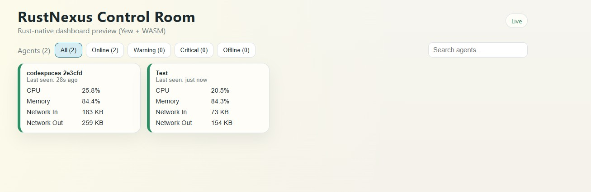
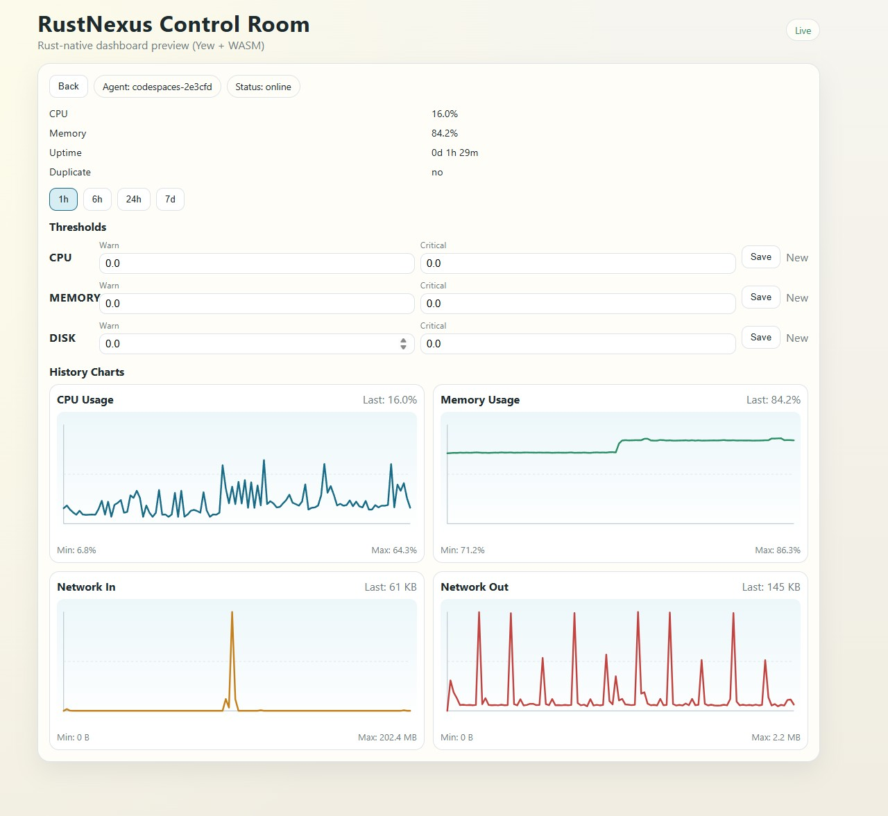

# RustNexus

A lightweight distributed system monitoring tool. Agents run on the machines you want to watch, ship metrics to a central collector, and a dashboard gives you a live view of everything.

```
[agent] ──POST /api/v1/metrics──► [collector] ──SQLite
                                       │
                              WebSocket /ws
                                       │
                                  [dashboard]
```

---

## Components

| Component | Description |
|-----------|-------------|
| **agent** | Runs on each monitored host. Collects CPU, memory, disk, network, and uptime at a configurable interval and ships them to the collector. Buffers payloads locally if the collector is unreachable. |
| **collector** | Central server. Accepts metrics via HTTP, persists them to SQLite, evaluates alert thresholds, and pushes live updates to connected dashboard clients over WebSocket. Also serves the dashboard static files. |
| **dashboard** | Rust WASM dashboard frontend (Yew). |

---

## Installation

### Prerequisites

- [Rust](https://rustup.rs/) (stable toolchain)
- [`trunk`](https://trunkrs.dev/) for serving/building the Rust WASM dashboard

### Build from source

```bash
# Clone the repo
git clone https://github.com/tnargy/RustNexus.git
cd RustNexus

# Build collector and agent (release)
cargo build --release --bin agent --bin collector

# Build the dashboard (Rust WASM)
cd dashboard && trunk build --release && cd ..
```

Binaries will be at `target/release/agent` and `target/release/collector`. The dashboard static files will be in `dashboard/dist/`, which the collector serves automatically.

For local dashboard development (`Trunk.toml` already handles the API and WebSocket proxies):

```bash
cd dashboard && trunk serve
```

### Pre-built artifacts

Downloadable `.zip` (Windows) and `.tar.gz` (Linux) packages are produced by the manual GitHub Actions workflow. Navigate to **Actions → Build → Run workflow** to trigger a build, then download the artifact from the completed run. Each package contains both binaries and the built dashboard.

**Linux**

```bash
# Extract the archive
tar -xzf rustnexus-linux-x86_64.tar.gz -C rustnexus/
cd rustnexus/

# Start the collector (dashboard is served from ./dashboard/)
./collector collector.toml

# On each monitored host, start the agent
./agent agent.toml
```

**Windows**

Extract `rustnexus-windows-x86_64.zip`, create config files following the Configuration section below, then:

```powershell
.\collector.exe collector.toml
.\agent.exe agent.toml
```

See the Configuration section for all available options. Example config files (`collector.example.toml`, `agent.example.toml`) are included in the repository.

---

## Screenshots

### Landing Page — Agent Overview



### Detail View — Single Agent



---

## Configuration

### Collector — `collector.toml`

```toml
listen_addr            = "0.0.0.0:8080"
database_path          = "./data/metrics.db"
dashboard_dir          = "/dashboard"
offline_threshold_secs = 120    # seconds without a report before an agent is marked offline
retention_days         = 30     # how long metric history is kept
log_level              = "info" # error | warn | info | debug | trace
hmac_secret            = "super-secret-password"          # set to a non-empty string to enable HMAC-SHA256 request signing
```

Start the collector:

```bash
./target/release/collector collector.toml
```

When no config file is supplied the collector falls back to built-in defaults (`0.0.0.0:8080`, `./data/metrics.db`) which is convenient for local development.

### Agent — `agent.toml`

```toml
agent_id             = ""          # leave empty to use the machine hostname
collector_url        = "http://collector-host:8080/api/v1/metrics"
interval_secs        = 30          # how often metrics are collected and sent
buffer_duration_secs = 300         # how long to buffer payloads when offline (5 min)
log_level            = "info"
hmac_secret          = "super-secret-password"          # set to a non-empty string to enable HMAC-SHA256 request signing
tags                 = "console"          # comma-separated, e.g. "production,web,eu-west"
```

Start the agent:

```bash
./target/release/agent agent.toml
```

The `RUST_LOG` environment variable overrides `log_level` in both binaries.

---

## Standards

| Standard | How it is applied |
|----------|-------------------|
| **[RFC 7807](https://www.rfc-editor.org/rfc/rfc7807)** — Problem Details for HTTP APIs | All non-2xx responses carry a `Content-Type: application/problem+json` body with `type`, `title`, `status`, and `detail` fields. |
| **[ISO 8601](https://www.iso.org/iso-8601-date-and-time-format.html) / [RFC 3339](https://www.rfc-editor.org/rfc/rfc3339)** — Date and time | Every timestamp in request and response bodies is serialized as `2026-03-12T12:00:00Z`. |
| **[OpenAPI 3.0.3](https://spec.openapis.org/oas/v3.0.3)** — API description format | A machine-readable contract is embedded in the collector binary and served at `GET /openapi.yaml`. Use it with Swagger UI, Redoc, or any OpenAPI-compatible tooling. |

**RFC 7807 error body example**

```json
{
  "type": "about:blank",
  "title": "Not Found",
  "status": 404,
  "detail": "Agent 'server-01' was not found."
}
```

---

## API Reference

Base URL: `http://<collector-host>:<port>`

All endpoints return JSON. A permissive CORS policy is applied to every response.

### Operations

| Method | Path | Description |
|--------|------|-------------|
| `GET` | `/health` | Liveness check. Returns `200 {"status":"ok","version":"…","timestamp":"…"}`. Suitable for load-balancer probes and Kubernetes liveness checks. |
| `GET` | `/openapi.yaml` | OpenAPI 3.0.3 specification for this API (YAML). |

### Metrics ingest

| Method | Path | Description |
|--------|------|-------------|
| `POST` | `/api/v1/metrics` | Receive a metric payload from an agent. Used by the agent binary — not intended for direct use. |

### Agents

| Method | Path | Description |
|--------|------|-------------|
| `GET` | `/api/v1/agents` | List all known agents with their current computed status. Returns `[]` when no agents have reported yet. |
| `GET` | `/api/v1/agents/{agent_id}/snapshot` | Latest metric reading for a single agent. `404` if the agent is unknown. |
| `GET` | `/api/v1/agents/{agent_id}/history` | Time-series data for a single agent, subsampled to ≤ 300 points. |

**History query parameters**

| Parameter | Values | Default |
|-----------|--------|---------|
| `range` | `1h`, `6h`, `24h`, `7d` | `1h` |

**Agent status values**

| Status | Meaning |
|--------|---------|
| `online` | Reporting within `offline_threshold_secs`, no threshold breaches |
| `warning` | Reporting, at least one metric is above its warning threshold |
| `critical` | Reporting, at least one metric is above its critical threshold |
| `offline` | No report received within `offline_threshold_secs` |

### Thresholds

Thresholds can target all agents (omit `agent_id`) or a specific agent. Supported metric names: `cpu`, `memory`, `disk`. A value of `0.0` disables alerting for that level.

| Method | Path | Description |
|--------|------|-------------|
| `GET` | `/api/v1/thresholds` | List all configured thresholds. |
| `POST` | `/api/v1/thresholds` | Create a threshold. Returns `201` with the created record. |
| `PUT` | `/api/v1/thresholds/{id}` | Update warning and critical values. Returns `200` with the updated record or `404`. |
| `DELETE` | `/api/v1/thresholds/{id}` | Delete a threshold. Returns `204` or `404`. |

**POST / PUT body**

```json
{
  "agent_id": null,
  "metric_name": "cpu",
  "warning_value": 75.0,
  "critical_value": 90.0
}
```

`PUT` only accepts `warning_value` and `critical_value` (id and metric name are immutable).

### WebSocket

| Path | Description |
|------|-------------|
| `GET /ws` | Upgrade to WebSocket. Pushes a `metric_update` event to all connected clients after each successful ingest. |

**`metric_update` event shape**

```json
{
  "event": "metric_update",
  "agent_id": "server-01",
  "timestamp": "2026-03-11T12:00:00Z",
  "status": "online",
  "cpu_percent": 14.2,
  "memory": { "used_bytes": 4294967296, "total_bytes": 17179869184, "percent": 25.0 },
  "disks": [{ "mount_point": "/", "used_bytes": 53687091200, "total_bytes": 107374182400, "percent": 50.0 }],
  "network": { "bytes_in": 102400, "bytes_out": 51200 },
  "uptime_seconds": 86400,
  "duplicate_flag": false
}
```

### Dashboard

Any path not matched by the API is served from the compiled dashboard SPA. Unknown client-side routes fall back to `index.html`.

---

## Project Structure

```
RustNexus/
├── Cargo.toml              # workspace manifest
├── agent/                  # agent binary (Rust)
│   ├── agent.example.toml
│   └── src/
├── collector/              # collector binary + REST API + WebSocket (Rust / Axum / SQLite)
│   ├── collector.example.toml
│   ├── openapi.yaml        # OpenAPI 3.0.3 spec (embedded in binary; served at GET /openapi.yaml)
│   └── src/
├── dashboard/              # Rust WASM frontend (Yew)
│   ├── Trunk.toml          # trunk build/serve config (target, dist dir, dev proxies)
│   ├── index.html
│   ├── dist/               # compiled static output served by the collector
│   └── src/
├── data/                   # SQLite database directory (created at runtime)
└── shared/                 # common types shared between agent and collector
    └── src/
```
